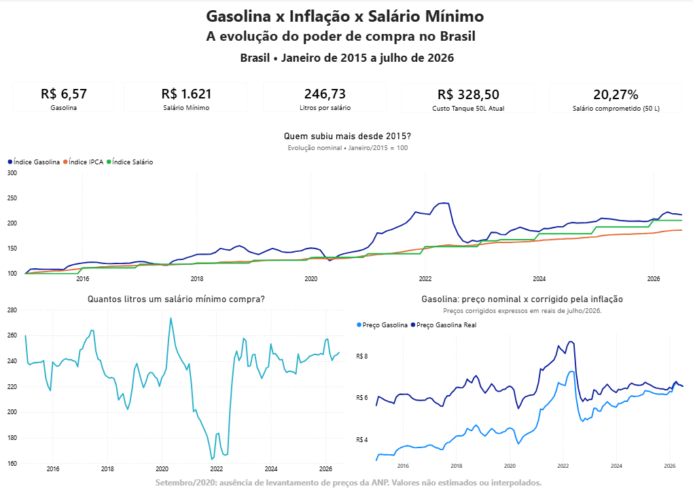

# Gasolina x Inflação x Salário Mínimo

### A gasolina realmente ficou mais cara para o brasileiro ou o salário mínimo acompanhou sua evolução?

Análise da evolução do preço médio da gasolina comum, da inflação e do salário mínimo nacional no Brasil, entre janeiro de 2015 e julho de 2026.

O projeto utiliza dados oficiais e um pipeline de tratamento desenvolvido em Python para investigar como o poder de compra, medido em litros de gasolina, mudou ao longo do período.

**Tecnologias:** Python, Pandas, Power BI, Power Query e DAX.

**Período analisado:** janeiro/2015 a julho/2026.

> O ano de 2026 é considerado apenas até julho. Os resultados apresentados não correspondem a uma comparação entre anos completos.

---

## Dashboard



Dashboard interativo desenvolvido no Power BI, com indicadores de preço, salário mínimo, poder de compra e evolução histórica.

O painel contém:

- Preço médio da gasolina comum;
- Salário mínimo nacional;
- Litros compráveis com um salário mínimo;
- Custo de um tanque de 50 litros;
- Percentual do salário necessário para abastecer 50 litros;
- Evolução comparativa da gasolina, do IPCA e do salário mínimo;
- Evolução do poder de compra;
- Comparação entre preço nominal e preço corrigido pela inflação.

---

## 1. Objetivo

Investigar se o crescimento do salário mínimo acompanhou a evolução do preço da gasolina comum no Brasil.

A análise busca responder:

1. Como o preço da gasolina evoluiu em comparação com a inflação?
2. O salário mínimo acompanhou o aumento do combustível?
3. Quantos litros de gasolina um salário mínimo comprava no início e no final do período?
4. Quanto do salário mínimo é necessário para comprar um tanque de 50 litros?
5. Qual foi a variação real do preço da gasolina, após o ajuste pelo IPCA?

---

## 2. Principais resultados

Comparação entre janeiro de 2015 e julho de 2026:

| Indicador | Jan/2015 | Jul/2026 | Variação |
|---|---:|---:|---:|
| Gasolina comum | R$ 3,032/L | R$ 6,57/L | +116,69% |
| Salário mínimo | R$ 788 | R$ 1.621 | +105,71% |
| IPCA — número-índice | 4.110,20 | 7.657,73 | +86,31% |
| Litros por salário mínimo | 259,89 L | 246,73 L | -5,07% |
| Tanque de 50 litros | R$ 151,60 | R$ 328,50 | +116,69% |
| Percentual do salário para 50 L | 19,24% | 20,27% | +1,03 p.p. |

**Alta real da gasolina no período: 16,31%.**

### O que os resultados mostram?

O preço nominal da gasolina aumentou 116,69%, enquanto o salário mínimo cresceu 105,71%.

Como consequência, a quantidade de gasolina comprável com um salário mínimo diminuiu 5,07%.

Em janeiro de 2015, um salário mínimo comprava aproximadamente 259,89 litros. Em julho de 2026, essa quantidade era de 246,73 litros.

O comprometimento do salário com um tanque de 50 litros também aumentou, passando de 19,24% para 20,27%.

Após o ajuste pela inflação, a gasolina apresentou alta real de 16,31%.

---

## 3. Fontes dos dados

Foram utilizadas três fontes principais.

### ANP — Agência Nacional do Petróleo, Gás Natural e Biocombustíveis

Série histórica mensal do Levantamento de Preços de Combustíveis, abrangência Brasil.

- Produto: gasolina comum;
- Indicador: preço médio de revenda;
- Periodicidade: mensal;
- Unidade: R$/litro.

Fonte:
[ANP — Série histórica do levantamento de preços](https://www.gov.br/anp/pt-br/assuntos/precos-e-defesa-da-concorrencia/precos/precos-revenda-e-de-distribuicao-combustiveis/serie-historica-do-levantamento-de-precos)

### IBGE — IPCA

Série histórica do Índice Nacional de Preços ao Consumidor Amplo, obtida pelo SIDRA.

- Tabela: 1737;
- Abrangência: Brasil;
- Variáveis utilizadas: número-índice e variação mensal;
- Periodicidade: mensal.

Fonte:
[IBGE/SIDRA — Tabela 1737](https://sidra.ibge.gov.br/tabela/1737)

### Salário mínimo nacional

Série histórica dos valores nominais do salário mínimo nacional, organizada por data de vigência.

Referências:

- [Previdência — Histórico do salário mínimo (2017–2019)](https://www.gov.br/previdencia/pt-br/assuntos/previdencia-social/arquivos/versao-onlinte-aeps-2019-/secao-xv-indicadores-economicos/capitulo-47-indicadores-economicos/47-1-salario-minimo-2017-2019)
- [Previdência — Histórico do salário mínimo (2020–2022)](https://www.gov.br/previdencia/pt-br/assuntos/previdencia-social/arquivos/copy_of_onlinte-aeps-2022-/secao-xv-indicadores-economicos/capitulo-47-indicadores-economicos/47-1-salario-minimo-2017-2019)
- [Previdência — Histórico do salário mínimo (2022–2024)](https://www.gov.br/previdencia/pt-br/assuntos/previdencia-social/arquivos/aeps-2024/secao-xv-indicadores-economicos/capitulo-47-indicadores-economicos/47-1-salario-minimo-2017-2019)
- [Decreto nº 12.342/2024 — Salário mínimo de 2025](https://www.planalto.gov.br/ccivil_03/_ato2023-2026/2024/decreto/d12342.htm)
- [Decreto nº 12.797/2025 — Salário mínimo de 2026](https://www.presidencia.gov.br/ccivil_03/_ato2023-2026/2025/decreto/d12797.htm)

---

## 4. Tecnologias utilizadas

| Tecnologia | Aplicação no projeto |
|---|---|
| Python | Desenvolvimento do pipeline de dados |
| Pandas | Limpeza, transformação, integração e validação |
| OpenPyXL | Leitura dos arquivos Excel da ANP |
| Power Query | Importação e conferência dos tipos de dados |
| Power BI | Modelagem e construção do dashboard |
| DAX | Medidas e indicadores analíticos |
| Git/GitHub | Versionamento e disponibilização do projeto |

---

## 5. Pipeline de dados

O projeto utiliza um processo de extração, transformação e integração de dados.

```text
ANP               IBGE/SIDRA          Salário mínimo
 │                    │                     │
 └────────────────────┼─────────────────────┘
                      │
                      ▼
              Arquivos brutos
                data/raw/
                      │
                      ▼
                Python/Pandas
                      │
            Limpeza e padronização
                      │
                      ▼
              Bases processadas
             data/processed/
                      │
                      ▼
             Integração por mês
                      │
                      ▼
             Métricas analíticas
                      │
                      ▼
          base_analitica_final.csv
                      │
                      ▼
             Power Query / DAX
                      │
                      ▼
               Dashboard
                 Power BI
```

Os arquivos originais são preservados na pasta `data/raw`.

As transformações são executadas por código, gerando novos arquivos na pasta `data/processed`.

---

## 6. Tratamento e integração

### ANP

O processo identifica o cabeçalho da planilha, seleciona a gasolina comum e mantém as colunas relacionadas ao mês, preço médio de revenda e quantidade de postos pesquisados.

Os registros são filtrados a partir de janeiro de 2015, ordenados cronologicamente e submetidos a verificações de tipos, duplicidades, valores ausentes e continuidade mensal.

### IPCA

O arquivo original contém dois blocos: número-índice e variação mensal.

Os blocos são carregados separadamente, transformados do formato de meses em colunas para meses em linhas e integrados pela referência temporal.

Os nomes dos meses são convertidos em datas no padrão `YYYY-MM-DD`.

### Salário mínimo

Os valores originais são registrados por data de vigência.

A série é expandida mensalmente com `merge_asof`, associando a cada mês o valor do salário mínimo vigente naquela data.

Esse tratamento preserva as alterações ocorridas em fevereiro de 2020 e maio de 2023.

### Integração final

As três fontes são integradas pela coluna `data`.

O calendário mensal do IPCA é utilizado como referência temporal, preservando todos os meses entre janeiro/2015 e julho/2026.

A base integrada possui 139 registros mensais.

---

## 7. Indicadores calculados

### Litros por salário mínimo

Quantidade de gasolina comprável com um salário mínimo:

```text
litros_por_salario =
    salario_minimo / preco_gasolina
```

### Custo de um tanque de 50 litros

```text
custo_tanque_50l =
    preco_gasolina * 50
```

### Percentual do salário necessário para 50 litros

```text
percentual_salario_tanque =
    (custo_tanque_50l / salario_minimo) * 100
```

### Índices base 100

As séries da gasolina, do IPCA e do salário mínimo são normalizadas usando janeiro/2015 como referência:

```text
indice_base_100 =
    (valor_do_mes / valor_de_janeiro_2015) * 100
```

Isso permite comparar séries originalmente expressas em unidades diferentes.

### Preço real da gasolina

O preço histórico é corrigido pela variação do IPCA:

```text
preco_gasolina_real =
    preco_gasolina
    * (IPCA_referencia / IPCA_do_mes)
```

A referência utilizada é julho de 2026.

A variação real entre o primeiro e o último período é calculada pela razão entre os preços corrigidos, menos um.

---

## 8. Qualidade dos dados e limitações

### Ausência de setembro de 2020

A série da ANP não possui levantamento de preços para setembro de 2020.

O mês foi preservado na base integrada, mantendo como ausentes os campos que dependem da gasolina.

Não foram utilizadas estimativas, interpolação ou substituição pelo preço dos meses vizinhos.

### Período parcial

A análise termina em julho de 2026.

Os resultados comparam janeiro/2015 e julho/2026, e não dois anos completos.

### Referência de renda

O salário mínimo nacional é utilizado como indicador de poder de compra.

Os resultados não representam automaticamente a renda ou a capacidade de consumo de toda a população brasileira.

### Abrangência geográfica

Os preços utilizados representam a média nacional da gasolina comum pesquisada pela ANP.

Existem diferenças de preços entre estados, municípios e postos.

### Interpretação da inflação

A diferença entre duas variações nominais em pontos percentuais não corresponde diretamente à variação real.

O encarecimento real da gasolina foi calculado pelo ajuste do preço com o número-índice do IPCA.

---

## 9. Estrutura do projeto

```text
gasolina-poder-de-compra/
│
├── data/
│   ├── raw/
│   │   ├── anp_gasolina.xlsx
│   │   ├── ipca.csv
│   │   └── salario_minimo.csv
│   │
│   └── processed/
│       ├── anp_gasolina_mensal.csv
│       ├── ipca_mensal.csv
│       ├── salario_minimo_mensal.csv
│       ├── base_analitica.csv
│       └── base_analitica_final.csv
│
├── src/
│   ├── inspect_data.py
│   └── prepare_data.py
│
├── powerbi/
│   └── gasolina_poder_de_compra.pbix
│
├── images/
│
├── README.md
├── PROGRESSO.md
├── requirements.txt
└── .gitignore
```

---

## 10. Como executar

### Requisitos

- Python instalado;
- Dependências descritas em `requirements.txt`;
- Arquivos de origem na pasta `data/raw`;
- Power BI Desktop para abrir o dashboard.

### 1. Criar o ambiente virtual

No terminal, na pasta principal do projeto:

```powershell
python -m venv .venv
```

### 2. Ativar o ambiente no Windows PowerShell

```powershell
.\.venv\Scripts\Activate.ps1
```

### 3. Instalar as dependências

```powershell
python -m pip install -r requirements.txt
```

### 4. Executar o pipeline

```powershell
python src/prepare_data.py
```

Os arquivos tratados serão gerados em:

```text
data/processed/
```

A base utilizada pelo dashboard é:

```text
data/processed/base_analitica_final.csv
```

### 5. Abrir o dashboard

Abra o arquivo:

```text
powerbi/gasolina_poder_de_compra.pbix
```

Caso o projeto seja executado em outro computador, atualize o caminho da fonte CSV nas configurações do Power Query antes de atualizar os dados.

---

## 11. Conclusão

Entre janeiro de 2015 e julho de 2026, o salário mínimo nacional cresceu, mas não acompanhou integralmente a evolução do preço médio da gasolina comum.

O poder de compra medido em litros diminuiu 5,07%, passando de aproximadamente 259,89 para 246,73 litros por salário mínimo.

No mesmo intervalo, a gasolina apresentou alta real de 16,31%, após o ajuste pelo IPCA.

Considerando o salário mínimo nacional e o preço médio da gasolina comum como referências, os resultados indicam uma perda de poder de compra em relação a esse combustível entre os dois períodos analisados.